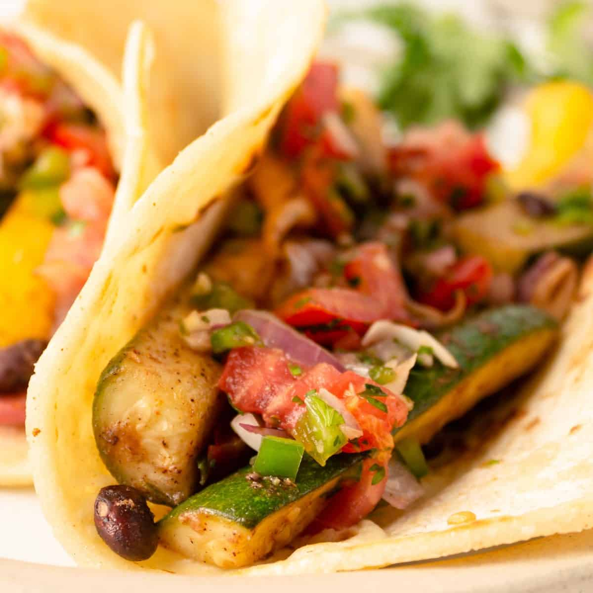

# 🌮 Little Taco Shop

Welcome to **The Little Taco Shop**, a simple and stylish multi-page HTML/CSS website created as a beginner-friendly project to practice front-end web development.

---

## 🚀 Live Demo

You can host this on GitHub Pages or any static hosting provider to showcase your skills.

---

## 📄 Pages Included

- `index.html` — Home, About, and Menu sections
- `contact.html` — Contact form and shop location
- `hours.html` — Store opening hours

---

## 📁 Folder Structure

```
little-taco-shop/
├── CSS/
│   └── style.css
├── img/
│   ├── Taco-icon.png
│   ├── tacos_and_drink.jpeg
│   ├── tacos_close_up.jpg
│   └── tacos_tray.jpg
├── index.html
├── contact.html
├── hours.html
└── README.md
```

---

## 🎨 Features

- Semantic HTML5 structure
- Clean and responsive layout
- Navigation between pages
- Contact form (uses httpbin.org for demo purposes)
- Informational content with real-world inspired layout

---

## 📸 Screenshots


> Tacos and a Drink


> Little Taco Shop Tacos

---

## 👨‍💻 Author

Designed and developed by [Wail Hassan](https://github.com/wailhassan)

---

## 📜 License

This project is for learning and educational purposes.
